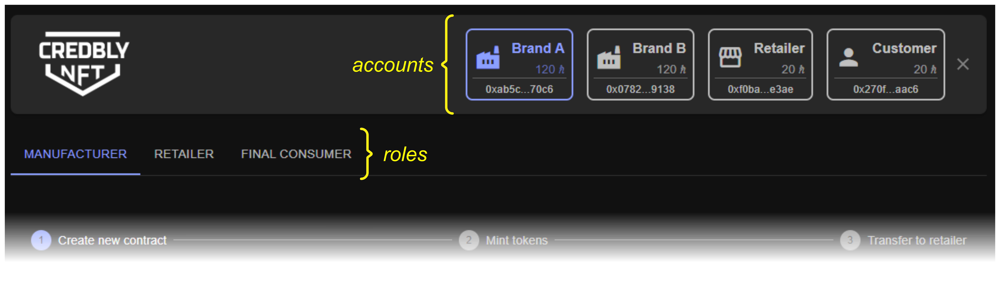
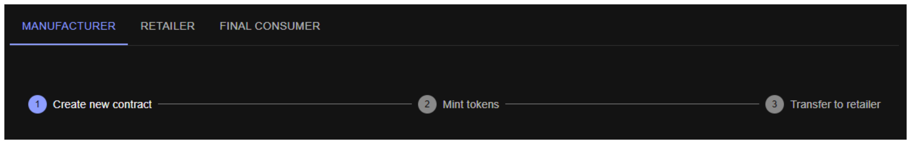

# CredblyNFT

CredblyNFT is an application designed to curb the trade of counterfeit products.
It is a decentralized application (dApp) that operates via smart contracts and direct calls to the Hedera network using provided SDKs and APIs.

## Overview

The application consists of main contracts and dynamically generated clients contracts:

### Contracts

- **Credbly\_Master**: Acts as the entry point for brand owners. Through the `createContract` function, it creates a new `Credbly_Client` contract. Receives commission fees for minted tokens.
  
- **Credbly\_ClientFactory**: Contains the code for `Credbly_Client` and enables dynamic creation of new contracts via `Credbly_Master`.
  
- **Credbly\_Holder**: Holds information of NFTs to be claimed by end consumers, according to the cryptographic combination provided by the invoice/password pair.
  
- **Credbly\_Client**: Dynamically generated contracts that handles tokens creation, minting, burning and NFTs minting after sales.


## Frontend Application

This repository contains a frontend application that simulates all project functionalities.
You'll need an Hedera Testnet account, that can be created via the [Hedera Portal](https://portal.hedera.com/dashboard)
([tutorial](https://docs.hedera.com/hedera/networks/testnet/testnet-access)).

### Accounts

The simulation creates 4 subaccounts, consuming `280 Hbars` to cover transactions:

1. **Brand\_A** and **Brand\_B**: Represent brand owners that creates `Credbly_Client` contracts for different products lines (e.g., footwear, apparel, sports equipment). Credited with `120 Hbars` each.
2. **Retailer**: Represents the retailer who receives tokens and demands the conversion to NFTs. Credited with `20 Hbars`.
3. **Customer**: Represents the end consumer who claims NFTs. Credited with `20 Hbars`.

Account are stored in the browser’s `localStorage`, to avoid creating new accounts on further access.

---

## Application Structure



The application is divided in 3 parts:

### 1. Toolbar

Displays the CredblyNFT logo and accounts. Each account is represented by an element containing an icon, account name, balance and it's address (clickable for copying to the clipboard).

### 2. Roles

Allows navigation based on the user role: Manufacturer, Retailer, or Final Consumer.

### 3. Content

Displays interaction screens tailored to the selected user role.

---

## Roles

### Manufacturer

The manufacturer interface features a stepper guiding user through necessary actions:



1. **Create New Contract**: creates a new Client contract with the Name and URI provided.
The URI must end in `/{sku}.json` so that the application will look for the `.json` file replacing the `{sku}` for the real SKU, assuring to the end consumer that the NFT was actually generated by who owns the domain.
Once registered, the URI cannot be used by another account.

   Example:

   - URI: `https://www.nike.com/footwear/{sku}.json`
   - SKUs: `NK-FOOT-001`, `NK-FOOT-002`, `NK-FOOT-003`
   - Metadata:
     - `https://www.nike.com/footwear/NK-FOOT-001.json`
     - `https://www.nike.com/footwear/NK-FOOT-002.json`
     - `https://www.nike.com/footwear/NK-FOOT-003.json`

2. **Mint Tokens**: mints tokens reflecting the real production. An amount is sent to support the creation of new tokens (one for each new SKU), calculated like this:

   - `1 + (16 * number_of_new_tokens)` Hbars

   For each minted token, a small commission is sent to `Credbly_Master`.

3. **Transfer to Retailer**: Associates and transfers tokens to retailers by specifying SKUs and quantities.

### Retailer

Single screen to simulate selling products to consumers. 
- Contracts from different manufacturers can be selected, reflecting consumers shop cart.
- The invoce and user's password are hashed and sent to `Credbly_Holder` along with the sold products and quantities.
- The amount of tokens are burned and NFTs are minted.
- The information is kept by `Credbly_Holder` until the NFTs are claimed.

### Consumer

Consumers claim NFTs by following these steps:

- Upload the invoice file and enter the password.
- Click `Claim NFTs`. The application validates the unique hash, associates and transfers NFTs to the consumer's account.
- NFTs are displayed as cards on the interface.

---

## Smart Contracts Deployment

The source codes of smart contracts, written in Solidity, are located in the `/src/contracts/solidity` directory.

1. Deploy `Credbly_Holder`.
2. Deploy `Credbly_ClientFactory`, passing the `Credbly_Holder` address.
3. Deploy `Credbly_Master`, passing the `Credbly_Holder` and `Credbly_ClientFactory` addresses.
4. Execute `setMaster` on `Credbly_Holder` passing the `Credbly_Master` address.
5. Execute `setMaster` on `Credbly_ClientFactory` passing the `Credbly_Master` address.
6. Configure environment variables (`.env.local`) with `Credbly_Master` and `Credbly_Holder` IDs and EVM addresses.

---

## Frontend - Step by Step

Go to live version [CredblyNFT](https://credbly-nft.vercel.app/)

For testing purposes, the application contains fictional content for 5 different brands (exceptions for the unique URI rule). 
Choose one for Brand A and another for Brand B accounts, using the URI and SKUs according to the table below. Make sure to type them exactly as shown, as the fields are case-sensitive.
```
+---------+----------------------+-----------------------------------------------------------+------------------+
|  BRAND  |    SUGGESTED NAME    |                            URI                            |       SKU        |
+---------+----------------------+-----------------------------------------------------------+------------------+
| Chivas  | Chivas - whiskys     | https://credbly-nft.vercel.app/NFT/Chivas/{sku}.json      | CHV-WSK-001      |
|         |                      |                                                           | CHV-WSK-002      |
|         |                      |                                                           | CHV-WSK-003      |
+---------+----------------------+-----------------------------------------------------------+------------------+
| L'oreal | Loreal - haircare    | https://credbly-nft.vercel.app/NFT/Loreal/{sku}.json      | LRL-HAIR-001     |
|         |                      |                                                           | LRL-HAIR-002     |
|         |                      |                                                           | LRL-HAIR-003     |
+---------+----------------------+-----------------------------------------------------------+------------------+
| Nike    | Nike - Footwear      | https://credbly-nft.vercel.app/NFT/Nike/{sku}.json        | NK-FOOT-001      |
|         |                      |                                                           | NK-FOOT-002      |
|         |                      |                                                           | NK-FOOT-003      |
+---------+----------------------+-----------------------------------------------------------+------------------+
| Pfizer  | Pfizer - cardio      | https://credbly-nft.vercel.app/NFT/Pfizer/{sku}.json      | PFZ-CARDIO-001   |
|         |                      |                                                           | PFZ-CARDIO-002   |
|         |                      |                                                           | PFZ-CARDIO-003   |
+---------+----------------------+-----------------------------------------------------------+------------------+
| Rolex   | Rolex - wristwatches | https://credbly-nft.vercel.app/NFT/Rolex/{sku}.json       | RLX-WTC-001      |
|         |                      |                                                           | RLX-WTC-002      |
|         |                      |                                                           | RLX-WTC-003      |
+---------+----------------------+-----------------------------------------------------------+------------------+
```

### Step 0: Creation of the users accounts
On the welcome screen, provide the `ECDSA Account ID` and the `DER Encoded Private Key`, that can be obtained via [Hedera Portal Dashboard](portal.hedera.com/dashboard).

### Step 1:
- Make sure `Brand A` account is selected.
- Make sure `MANUFACTURER` role is selected.
- Make sure `Step 1 - Create new contract` is selected on the stepper.
- Fill `Contract Name` and `Contract URI` fields according to the chosen brand.
- Click `CREATE CONTRACT` button.
- Wait for the confirmation of the successful contract creation.

### Step 2:
- Select `Step 2 - Mint tokens` on the stepper, or click the right arrow.
- If the contract does not appear in the selector, click the reload button.
- Fill in `SKU`s with an `Amount` of `100` each.
- Click `MINT TOKENS` button.
- Wait for the confirmation of the successful minting.

### Step 3:
- Select `Step 3 - Transfer to retailer` on the stepper, or click the right arrow.
- If the contract does not appear in the selector, click the reload button.
- Fill in `SKU`s with an `Amount` of `5` each.
- Click `TRANSFER TO RETAILER` button.
- Wait for the confirmation of the successful transfer.

### Steps 4, 5, and 6:
- Repeat Steps 1, 2, and 3, selecting the `Brand B` account, and using the data of the other chosen brand.
  
### Step 7:
- Select `RETAILER` role.
- Make sure `Retailer` account is selected.
- For each line, select a contract, insert one of the `SKU`s corresponding to the brand, and enter the `amount` (ideally 1 or 2) up to a maximum of 5 (stock).
- Click `UPLOAD INVOICE FILE` button and select any file.
- Enter a `password` in the corresponding field (remember it).
- Wait for the confirmation that NFTs are available to be claimed.

### Step 8:
- Select `FINAL CONSUMER` role.
- Make sure `Customer` account is selected.
- Click `UPLOAD INVOICE FILE` button and select the same file used in the previous screen.
- Enter the `password` used in the previous screen.
- Click `CLAIM NFTS` button.
- Wait for the confirmation of the successful claiming.
- Wait for the NFT cards to be displayed.
  
### Step 9 (optional):
- If desired, you can withdraw the excess amount deposited in the contracts during the mint tokens operation.
- Select the `MANUFACTURER` role.
- Select `Step 1 - Create new contract` on the stepper.
- Select the `Brand A` or `Brand B` account.
- Wait for the contracts to load in the table.
- In the balance column, if not zeroed, click on the value and wait for the withdrawal confirmation.

---

## Requirements

- Browser with `localStorage` support and HTML5, CSS3, JavaScript (ES6+).
- Fast internet connection.
- JavaScript enabled.
- Minimum screen width: `900px`.
- Hedera Testnet account with at least `280 Hbars`.

---

## Technologies Used

- **Development**: VSCode, Remix, Hedera File Service, Hedera SDK, ChatGPT
- **Frontend**: Node.js, TypeScript, Vite, React, Material-UI, Hedera SDKs/APIs, Ethers, Web3
- **Hedera**: Solidity, Hedera Smart Contract Service, Hedera Token Service